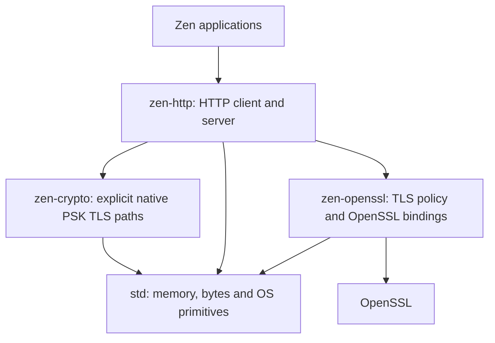

# zen-http

Standalone HTTP library for Zen. Experimental native PSK TLS client and HTTP/1 server paths use
`zen-crypto`; certificate-verified HTTPS still uses OpenSSL. HTTP belongs here; OpenSSL-backed TLS belongs
in the sibling `zen-openssl` package. `zen-crypto` contains native Zen algorithms
and `zen-sodium` separately exposes libsodium bindings. Standard-library allocation,
bytes and OS socket primitives remain underneath both.
HTTP/1 and HTTP/2 have moved out of std. Replace `std.net.http`,
`std.net.http2` and `env.net.http()` with explicit package imports and client
construction; see [migration instructions](docs/STD_HTTP_MIGRATION.md).
`std.net.tls` is a separate compatibility surface.



## Implemented

- `http.native_server.serve_psk(alloc, options, handler)` serves HTTP/1 over
  native external-PSK/X25519 TLS using the shared reactor, with resumable
  handshakes and record I/O. [Build, tests and limits](docs/NATIVE_TLS_REACTOR.md).
  This explicit experimental target links no OpenSSL/libsodium; it does not
  provide certificate authentication or browser HTTPS.

- `serve(alloc, options, handler)` runs a single-threaded HTTP/1.1 server.
  Implement `Handler.handle(Request) -> Response`; the echo application is in
  [examples/echo.zen](examples/echo.zen).
- Zen owns parsing, framing, request/response buffers, dispatch, connection
  state, partial writes and keep-alive/pipelining. Readiness uses kqueue on macOS
  and epoll on Linux through `std.net.readiness`; see the required compiler
  revision and H2 ownership details in [STD_READINESS.md](docs/STD_READINESS.md).
  Zen owns socket read/write decisions and TLS retry/readiness transitions.
  Zen also owns listener/connection allocation, socket setup and cleanup, and
  OpenSSL session creation. Both HTTP/1 and H2 use the std readiness owner;
  OS event layouts and syscall macros still require platform ABI bindings.
- An experimental HTTP/2 echo listener is available as `build/zen-h2-server`
  on loopback18082, with `--tls` enabling TLS1.3 and h2 ALPN. It has
  concurrent streams inside one active TCP connection; see its limits below.
- `HttpClient.post` / `post_into` and response decoding were extracted from
  the current standard-library implementation. They import `zen-openssl`'s
  `tls` module rather than `std.net.tls`.

Request strings are borrowed for the synchronous handler call. Do not retain
them, send them to an actor without copying, or return storage whose lifetime
has ended. Response bytes must remain live until the server copies them after
the handler returns. Allocation belongs to the caller; the server preallocates
its HTTP buffers and reuses them. Transports use an explicit std pool so
connection churn does not retain per-connection allocations in a long-lived
arena; its cache has a fixed limit. OpenSSL allocations remain separate and
are not claimed to be allocation-free.

Current server limits: IPv4; 256 simultaneous connections; 8 KiB / 64 fields per header block;
64 KiB request and response bodies; 36 MiB reserved for the HTTP connection
buffers (not a measured RSS figure); ten-second idle timeout; fixed
`application/octet-stream` response type; 200/400/404 response statuses.
Responses include a cached Date header. The OpenSSL target uses TLS 1.3 and
AES-128-GCM, matching the benchmark baseline. The native PSK target uses
TLS_CHACHA20_POLY1305_SHA256 and X25519; it has not been benchmarked. Invalid or unsupported framing
closes the connection. Bounded chunked request decoding is implemented; legal
chunk extensions and many trailers remain unsupported. Expect, upgrades,
streaming handlers, graceful shutdown and HTTP/3 are not implemented. The
HTTP/2 endpoint is a separate experimental server. This is an experimental package, not a production-ready HTTP stack.

## Native code and standard-library migration

See [the audited boundary and migration gates](docs/NATIVE_BOUNDARY.md). HTTP
protocol logic is Zen; OS adapters and vetted cryptographic backends remain
native dependencies. HTTP protocol implementations belong to this package. The std HTTP clients and
`env.net.http()` accessor have been removed; applications must explicitly depend
on the package. No std HTTP compatibility facade is installed.

## Build and verify

The build expects sibling compiler and OpenSSL package checkouts. From their parent directory:

```sh
git clone https://github.com/lantos1618/zen.git zen-actor-runtime
git clone https://github.com/lantos1618/zen-openssl.git
git clone https://github.com/lantos1618/zen-http.git
```

Build the compiler following its README, then from `zen-http`:

```sh
sh scripts/dependencies.sh
PYTHON=python3 sh scripts/test-dependencies.sh
PYTHON=python3 sh scripts/check.sh
python3 bench/run.py
```

Use a Python with TLS 1.3 support (the Xcode Python/LibreSSL on this machine
does not provide it). The build defaults to `../zen-actor-runtime/zen` and its
standard library; override `ZEN_COMPILER` and `ZEN_STD` together. `GO_BIN`
selects the load-generator toolchain; the workspace default is the existing
Go toolchain under `../zen-bench/build/toolchains/go/bin/go` when present,
otherwise `go` on PATH.

`scripts/build.sh` stages module symlinks under ignored `build/source`, emits
the real Zen code, and compiles it with the native headers and static OpenSSL.
The normal package target also builds with:

```sh
ZEN_STD=../zen-actor-runtime/src \
CPATH="$PWD/src:$PWD/../zen-openssl/src:$PWD/../zen-actor-runtime/src/std/net:$PWD/build/openssl/include" \
../zen-actor-runtime/zen build echo
```

The script supplies the same native dependencies explicitly for matched benchmark
optimization. `build.zen` declares the `http` and `tls` package dependencies. The build uses Clang
`-O3 -flto` for both Zen-generated C and native C++ uWebSockets, without changing
the compiler or its seed. Downloads and build products are local and ignored.

Start the example with `build/zen-server` or `build/zen-server --tls`.
It binds only `127.0.0.1:18080`. Generated certificates are local test fixtures.
The extracted TLS client verifies certificates and hostnames; a private
OpenSSL build needs an explicit trusted CA bundle, e.g. `SSL_CERT_FILE`.
It does not automatically use the macOS Keychain.

## Experimental native TLS client

`http.native_client` exposes `post_over_native_session` and
`post_over_native_session_into`. Both borrow an already authenticated
`zen-crypto.Tls13Session` and use the same HTTP response decoder as the existing
client. This path links no OpenSSL or libsodium. Import this module directly;
the current `http` facade and normal build still include the OpenSSL backend.

The caller establishes the external-PSK TLS session and owns its socket,
allocator, peer identity, fresh handshake randomness and deadlines. A URL's
hostname is **not** certificate-verified by this API. Only `https` URLs are
accepted. Use one request per session and close or abort it afterwards, even
on errors: the decoder can read ahead beyond a response boundary. Streaming
output can contain an authenticated prefix when a later operation fails.

With a sibling `zen-crypto` checkout and Python's `cryptography` installed:

```sh
ZEN_COMPILER=../zen-actor-runtime/zen ZEN_STD=../zen-actor-runtime/src \
python3 scripts/check-native-http.py
```

The check covers 215 decoder cases and eight encrypted scenarios, including
chunked and close-delimited responses, bad framing, tampering and raw EOF.
It checks native-only linkage, borrowed-session sequence continuity and
exactly-once session cleanup under UBSan. `SANITIZERS=address,undefined` enables
both sanitizers on supported hosts. This is an experimental blocking client;
the event-driven HTTP server and HTTP/2 TLS still use OpenSSL. Existing benchmark
results do not measure this native TLS path. See the [Linux validation report](docs/NATIVE_HTTP_VALIDATION.md)
for exact revisions, sanitizer coverage and retained limitations. The proposed
[next server integration](docs/NATIVE_TLS_REACTOR.md) makes TLS resumable before
connecting it to the HTTP reactor.

## Benchmark contract

See [the measured results](RESULTS.md), including losses and raw trial data.

Compare native C++ uWebSockets, not its Node.js wrapper. Both single-threaded
servers receive `POST /echo`, consume every request byte, and return the exact
binary payload with equivalent status, content type, content length and Date
headers. Both TLS variants use the same OpenSSL archive, certificate, version
and cipher, with OpenSSL read-ahead enabled in both. The uWS handler has an immediate-body path plus accumulation for
fragmented bodies, and keeps that storage alive through response completion.

The Go client verifies every status, length and payload. Connections and TLS
handshakes are established before the timed phase; one second of warmup precedes
each trial. Each connection has one outstanding request. Trials alternate server
order and record throughput plus p50/p95/p99 request/response latency. They are
closed-loop latency measurements, not latency under an independent arrival rate.
The runner saves every trial in `build/results.json`; `build/environment.txt`
records dependency revisions, compiler versions and hashes. Handshake throughput,
TLS client throughput, pipelined saturation and a remote load generator need
separate measurements. Local loopback and desktop load cannot establish a
universal performance ranking or reproduce the screenshots' unspecified setup.

Correctness checks cover binary bodies through 64 KiB, every split point in a
small request, sequential keep-alive, pipelining, slow readers, close behavior,
malformed lengths/headers and a negative control for the response validator.
Client checks cover plain HTTP, trusted TLS, and rejection of an untrusted
certificate. The complete limits and next implementation work are in
[docs/PLAN.md](docs/PLAN.md).

## HTTP/2 and the Zen boundary

`H2Client` is now exported from `http`. Its frame codec, HPACK/Huffman decoder,
SETTINGS handling, flow-control accounting and response processing are Zen
source in this package. It uses `zen-openssl` for verified TLS with mandatory
`h2` ALPN, or prior-knowledge plaintext HTTP/2. It supports sequential POST
streams on a persistent connection, buffered responses, sink output and actor
chunk delivery. It currently allows **one active request per connection**;
it is not a multiplexed client. The separate experimental HTTP/2 server now
uses request HPACK decoding, per-stream state and flow control. Published uWS
comparisons still use HTTP/1.1; no HTTP/2 performance claim is made.

Run `python3 scripts/check-http2.py` after building dependencies, using a Python
runtime with TLS 1.3. This compiles five migrated codec regression tests and a
Zen client, then checks three sequential streams against a separate Python wire
peer over plaintext and TLS, fragmented responses, and rejection without h2
ALPN. This is a bounded interoperability check, not full HTTP/2 conformance.

Server TLS policy and context lifetime now also live in Zen (`ServerContext`
in `zen-openssl`). OpenSSL supplies the cryptographic implementation. The remaining
C adapters cover platform readiness ABI, errno, date/time access, OpenSSL const
and callback signatures, and the Linux SIGPIPE-safe socket BIO. The BIO still
contains I/O policy. Socket setup, allocation, cleanup and nonblocking TLS retry
decisions are Zen. This is not yet an
entirely Zen transport. Existing standard-library APIs are retained for migration.


## Current hardening checkpoint

The HTTP/1 event loop budgets work per connection and preserves a userspace
runnable queue for buffered requests/TLS records. The transport regression test
forces socket backpressure and verifies retry direction, recovery and EOF. See
[HTTP/1 limits and validation](docs/HTTP1_HARDENING.md).

The HTTP/2 state component is now wired to an experimental echo listener with
request HPACK decoding, multiplexed streams and TLS ALPN. It services one TCP
connection at a time and has incomplete protocol error handling. See
[network endpoint limits](docs/H2_NETWORK.md), [request decoding](docs/H2_REQUEST.md)
and [state component](docs/HTTP2_SERVER.md).

HTTP/1 chunked requests are decoded incrementally into a bounded complete body;
this is not a streaming handler API. See [supported subset](docs/HTTP1_CHUNKED.md).

Run `build/zen-h2-server` (h2c) or `build/zen-h2-server --tls` on loopback18082.
The independent peer checks use pinned hyper-h2/hpack under ignored
`build/python-deps`, installed by `scripts/test-dependencies.sh` without changing
the global Python environment. `scripts/check.sh` runs normal and UBSan network
checks over plaintext/TLS, plus request decoder, chunk decoder and state tests.

The benchmark harness retains failed and interrupted runs and refuses to compare
incomplete cells. See [benchmark validation](docs/BENCHMARK_VALIDATION.md).

The std HTTP removal is tracked in [Zen PR #12](https://github.com/lantos1618/zen/pull/12);
older compiler checkouts still have those std APIs. The package works with both
the existing std and the proposed reduced std, as described in the migration guide.
